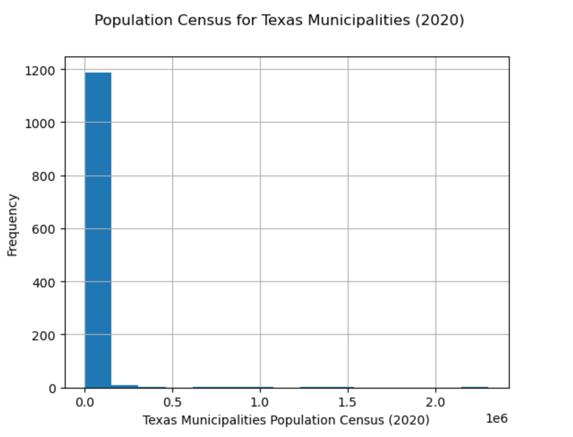

# I310D_Assignment7
This is the repository specifically for Assignment 7: Data Curation and Analysis.

GOAL: To extract population data from the many different municipalities in Texas, clean the data, and lastly perform analysis on it, like analyzing the percent change of each Texas municipality and comparing the differences in population between the top 10 Texas municipalities.

LICENSE: MIT License

SOURCE DATA: https://en.wikipedia.org/wiki/List_of_municipalities_in_Texas

DATA DICTIONARY (name, description, datatype):      
----------------------------------------------------------------------------------
- 2021 Rank: the rank of the city in 2021 based on the population, datatype: int
- Municipality: the municipality name, datatype: string
- Designation: whether the municipality was a city, village, or town, datatype: string
- Primary County: the county name of where the municipality was location, datatype: string
- 2021 Estimate: the population estimate of the municipality in 2021, datatype: int
- 2020 Census: the population census of the municipality in 2020, datatype: int
- 2010 Census: the population census of the municipality in 2010, datatype: int
- % Change: the municipality percent of population change between 2020 and 2021, datatype: float

ISSUES:
- Some datapoints were omitted due to having a "-" or null values in the columns with the 2020 and 2010 census
- This dataset only contains population information from 2020, 2021, and 2010
- The data is not normal due a skew in population with municipalities such as Houston, Dallas, and San Antonio.

NOTES:
- Used modules/APIs such as pandas, BeautifulSoup, requests, pyplot, matplotlib
- 1200+ datapoints, with 8 attributes

ANALYSIS: 

